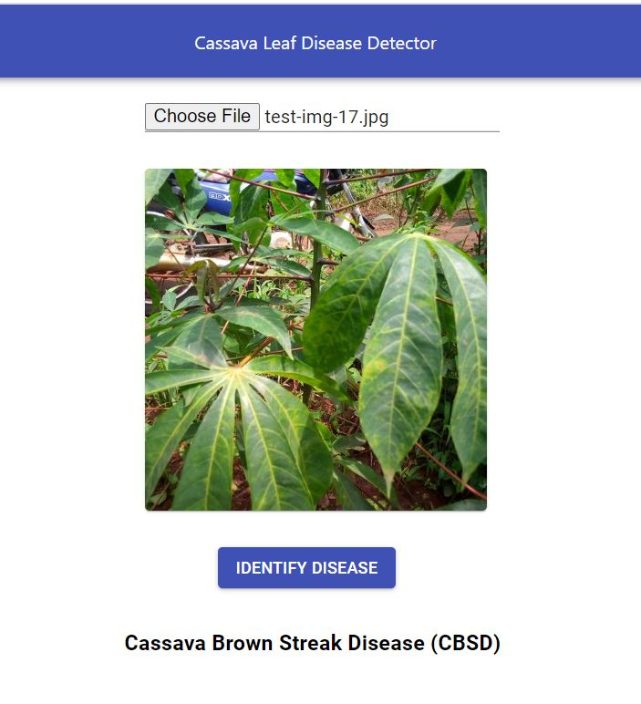

# Cassava Leaf Disease Detector

This project is based on the ongoing Kaggle competition **Cassava Leaf Disease Classification** wherein based on the image provide, disease engulfing Cassava Leaf is identified.

## Why this project is important?

This project is important because this is an end to end implementation (Fron model training to exposing API using FastApi to hooking it with UI created with ReactJS). The project structure and the code can be used as a **baseline for any type of ML classification/Object Detection/Segmentation** tasks and can be extended for other types of models.

## How to use this repo ?

### Part 1: Starting the API

    1. Checkout the repo and open it in VSCode
    2. Run command: cd cassava_leaf_classifier
    3. Install requirements: pip install -r requirements.txt
    4. Run the code with the configuration mentioned in launch.json under .vscode folder (or run command: uvicorn app.main:app --reload)
    5. Note the URL and Port number the API is running on (if it is different than 8000 than update PredictApiUrl in cassava_leaf_classifier\cassava-ui\src\components\UploadFiles.jsx )

### Part 2: Starting React JS UI

**Prerequisites**: NodeJS and NPM (Install from site)

    1. Navigate to cassava-ui folder with command: cd cassava-ui
    2. Run command: npm install
    3. Run command: npm start
    4. Navigate to the specified URI shown in terminal.

## Operating the App

Operation of app is very simple, just **upload a cassava leaf image** (can use SampleCassavaImage.jpg at cassava_leaf_classifier\SampleCassavaImage.jpg or any other image can also be used! ) and Click **Identify Disease**, You will see the disease predicted 

## Packages Used:

### For Machine Learning
    1. pytorch and pytorch-lightning is used to train the model
    2. albumentations is used for image Augmentation purposes
    3. fastapi for creation of API
    4. cv2 and pillow for image processing purposes
    5. efficientnet_pytorch for using pretrained 'efficientnet-b5' model as Transfer Learning

### For UI
    1. React.js
    2. Material-UI

## Model Training

Model is trained using pytorch-lightning library with EfficientNet architecture and the best model is saved inside trained_model folder as cassava_efficient_net.ckpt

## Configuration

If you want to train the model yourself, you can refer the code inside training folder and can change the configurations of the data path and other variables in config.py file.

## Contributing

Pull requests are welcome. We can grow this together to add many more use cases. Writing Tests are in Progress currently.

### Note: I will keep on updating the model to improve its performance in classification

## Thanks for reading and reaching the end!

